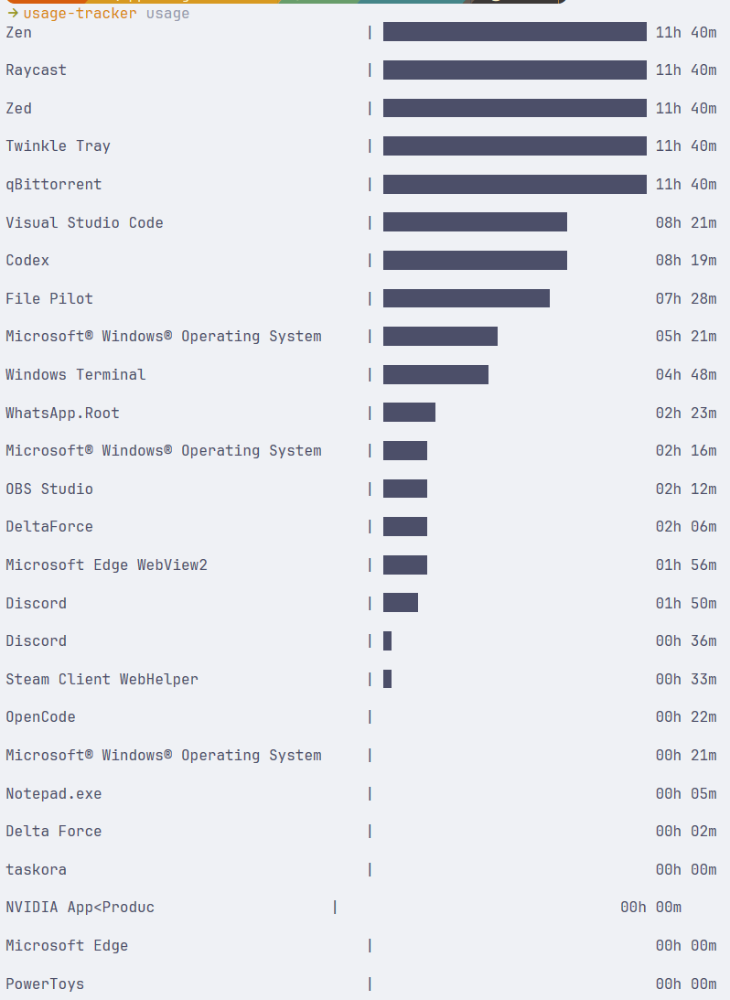

<div align="center">

# Usage Tracker

A lightweight, local-first Windows application usage tracker built with Rust.

[](https://github.com/HexCore99/app-usage-tracker/releases/latest)


[Download the v0.1.0 installer](https://github.com/HexCore99/app-usage-tracker/releases/download/v0.1.0/usage-tracker-0.1.0-x86_64.msi) · [View all releases](https://github.com/HexCore99/app-usage-tracker/releases)

</div>

Usage Tracker runs quietly in the background, records how long desktop applications have visible windows, and displays the results as a simple terminal report. All usage data stays on your computer in a local JSON file.

<p align="center">
  
</p>

## Features

- Discovers visible desktop applications through native Windows APIs.
- Tracks applications approximately once per second.
- Uses product metadata for readable names, with the executable name as a fallback.
- Runs as a detached background process and prevents duplicate tracker instances.
- Saves progress every minute and once more during a normal shutdown.
- Presents usage in a sorted terminal report with proportional bars.
- Supports automatic startup when signing in to Windows.
- Stores data locally—no account, cloud service, or telemetry is required.
- Includes an MSI installer with an option to add the command to `PATH`.

## Installation

### MSI installer (recommended)

1. Download [`usage-tracker-0.1.0-x86_64.msi`](https://github.com/HexCore99/app-usage-tracker/releases/download/v0.1.0/usage-tracker-0.1.0-x86_64.msi).
2. Run the installer and keep the **PATH Environment Variable** feature enabled.
3. Open a new PowerShell or terminal window so it receives the updated `PATH`.
4. Confirm the installation:

```powershell
usage-tracker --version
```

### Build from source

You need Windows, the Rust toolchain, and the MSVC build tools.

```powershell
git clone https://github.com/HexCore99/app-usage-tracker.git
cd app-usage-tracker
cargo build --release
.\target\release\usage-tracker.exe --version
```

## Quick start

Start the background tracker:

```powershell
usage-tracker
```

Let it run while you use your applications, then display the saved report:

```powershell
usage-tracker usage
```

Stop the tracker safely and save the latest usage data:

```powershell
usage-tracker kill
```

Running the executable without arguments—including by double-clicking it—starts the tracker. The explicit `run` command performs the same action and is useful in scripts.

## Commands

| Command | Description |
| --- | --- |
| `usage-tracker` | Start the tracker in the background. |
| `usage-tracker run` | Explicitly start the tracker. |
| `usage-tracker kill` | Save the current data and stop the tracker. |
| `usage-tracker usage` | Show the saved usage report. |
| `usage-tracker enable-autostart` | Register the tracker to start when you sign in. |
| `usage-tracker disable-autostart` | Remove the current Windows startup registration. |
| `usage-tracker -h` | Show command help. |
| `usage-tracker -v` | Show the installed version. |

The current release also registers itself for Windows startup on first launch. If you use `disable-autostart`, launching the program again will create the startup registration again.

## How tracking works

1. The tracker enumerates top-level windows and keeps those Windows reports as visible.
2. It resolves each window's process ID, executable path, and product name.
3. Known helper and Windows system components are filtered conservatively.
4. Applications are grouped by their full executable path and their durations are updated in memory.
5. The tracker periodically writes the accumulated results to disk.

This measures **visible-window time**, not strictly foreground or active-input time. Minimized applications may still count when Windows reports their windows as visible. Applications installed under version-specific paths may also appear as separate historical records after an update.

## Data and privacy

Usage data is stored at:

```text
%LOCALAPPDATA%\app-usage-tracker\usage.json
```

The same directory can temporarily contain `tracker.pid` and `stop.request`, which are used to coordinate the background process. The current implementation does not send usage data over the network.

Avoid editing `usage.json` while the tracker is running because the next scheduled save may overwrite those edits.

## Project structure

| Path | Responsibility |
| --- | --- |
| `src/main.rs` | CLI entry point and command dispatch. |
| `src/application.rs` | Application and usage data types. |
| `src/collector.rs` | Windows enumeration, executable lookup, naming, and filtering. |
| `src/tracker.rs` | Background lifecycle, timing, and graceful shutdown. |
| `src/storage.rs` | Local paths and JSON persistence. |
| `src/report.rs` | Sorted terminal usage report. |
| `src/startup.rs` | Windows startup registration. |
| `wix/main.wxs` | MSI installer definition. |

## Building the MSI

The installer uses WiX Toolset 7 and the modern-toolset support from `cargo-wix`. After installing those tools and accepting the WiX 7 EULA, run:

```powershell
cargo wix --toolset modern --nocapture
```

The generated installer is written to `target\wix`.

## Contributing

Bug reports, feature ideas, and pull requests are welcome through the [GitHub repository](https://github.com/HexCore99/app-usage-tracker).

Before submitting a change, run:

```powershell
cargo fmt --check
cargo check
cargo test
```
